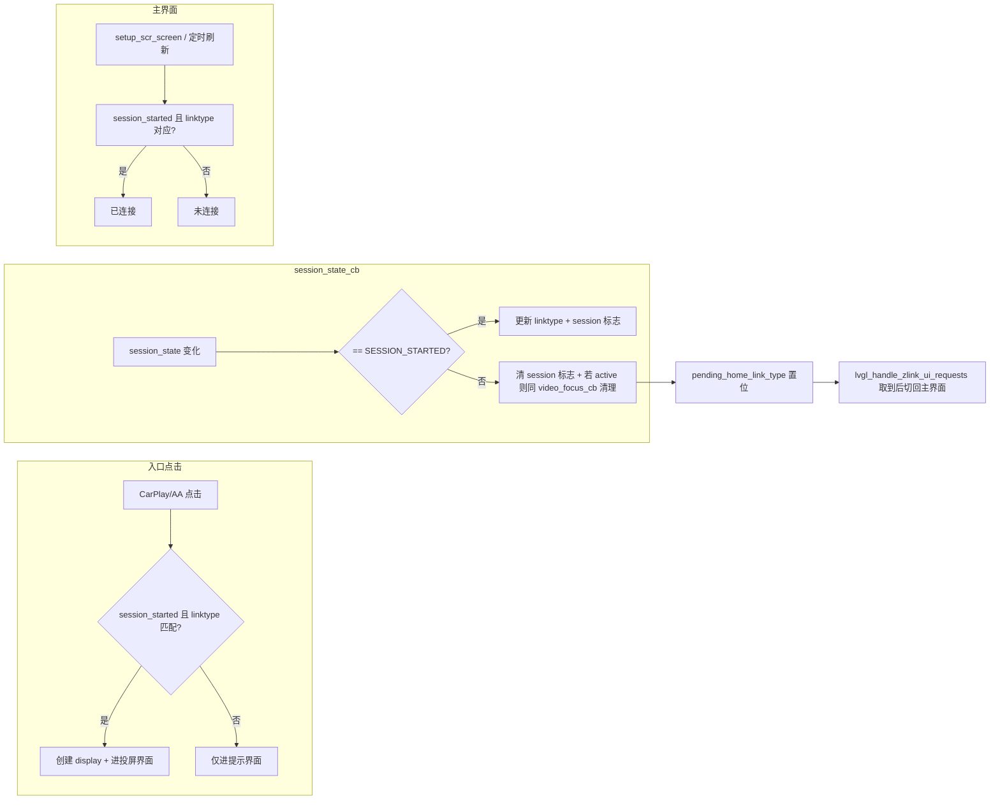

# CarPlay/Android Auto 业务逻辑优化方案

## 现状与目标

- **入口**：`screen_btn_carplay_event_handler`（CarPlay）、`screen_btn_androidauto_event_handler`（Android Auto）当前不区分 session 状态，点击即创建 display 并进入投屏界面。
- **主界面状态**：`screen_btn_carplay_label_statu` / `screen_btn_androidauto_label_statu` 仅根据 `g_sys_Data.linktype` 显示“已连接/未连接”，未结合 session 状态。
- **退出**：手机断开 WiFi 时由 libzlink 触发 `session_state_cb`（state 非 SESSION_STARTED）；目前仅 `video_focus_cb(1)` 会做 `carplay_display_destroy()` 等清理，需保证断开时也能走同一套清理并回到主界面。

目标：  
1）仅当 `session_state == SESSION_STARTED` 且 linktype 匹配时进入投屏界面，否则只进提示界面；  
2）主界面两个 label 在“SESSION_STARTED 且设备类型对应”时显示已连接，否则未连接；  
3）手机断开时通过 session 状态变化触发与 `video_focus_cb(1)` 一致的清理，并正常退出到主界面。

---

## 1. runcarplay：暴露 session 状态并在断开时做清理

**文件**：[runcarplay/src/carplay/zlink_client.c](runcarplay/src/carplay/zlink_client.c)、[runcarplay/src/carplay/zlink_client.h](runcarplay/src/carplay/zlink_client.h)

- **存储并暴露 session 状态**  
  - 在 `zlink_client.c` 内用静态变量保存当前是否为 `SESSION_STARTED`（及可选 `session_state` 枚举），用现有 `g_video_state.mutex` 或单独 mutex 保护。  
  - 在 `zlink_client.h` 中声明：`int zlink_client_is_session_started(void);` 实现内读该变量并返回 0/1。
- **在 `session_state_cb` 中**  
  - `session_state == SESSION_STARTED`：保持现有逻辑（设置 `g_sys_Data.linktype`、video focus 等），并更新“session started”为 true。  
  - `session_state != SESSION_STARTED`：  
    - 将“session started”置为 false。  
    - 若当前 `g_video_state.active == 1`，执行与 [video_focus_cb(1)](runcarplay/src/carplay/zlink_client.c) 相同的清理：  
      - 在 mutex 内：`g_video_state.active = 0`，`g_video_state.pending_home_link_type = g_sys_Data.linktype`（保存当前 linktype 再清空，以便 UI 知道从 CarPlay 还是 AndroidAuto 返回）。  
      - 调用 `carplay_display_destroy()`。
    - 将 `g_sys_Data.linktype` 置为 0（或 `LINK_TYPE_UNKOW`），使主界面显示“未连接”。
  - 不在此回调中调用任何 LVGL 或 UI 接口（可能在其他线程），仅改 zlink 内部状态和 `g_sys_Data.linktype`。
- **头文件**  
  - `#ifdef ENABLE_CARPLAY` 内增加 `zlink_client_is_session_started()` 声明。

这样：手机断开 WiFi 时，`session_state_cb` 会先（或代替）把“退出到主界面”的请求写入 `pending_home_link_type` 并销毁 display，现有 [lvgl_handle_zlink_ui_requests](lvgl-gui/lvgl_main.c) 轮询 `zlink_client_take_pending_home_request()` 即可照常切回主界面。

---

## 2. 入口逻辑：仅 SESSION_STARTED 且 linktype 匹配时进投屏

**文件**：[lvgl-gui/ui/generated/screen_events_init.c](lvgl-gui/ui/generated/screen_events_init.c)

- **screen_btn_carplay_event_handler（CarPlay 入口）**  
  - 在 `#ifdef ENABLE_CARPLAY` 分支内、现有“进入投屏界面”代码块（约 149–165 行）前增加判断：  
    - 若 `!zlink_client_is_session_started() || g_sys_Data.linktype != LINK_TYPE_CARPLAY`：  
      - 不执行 `zlink_client_reset_video_prebuffer()`、`carplay_display_create()`、`zlink_client_set_video_active(1)` 等投屏逻辑。  
      - 仅执行“进入提示界面”：`ui_load_scr_animation(..., screen_carPlay, ...)`（即当前 167 行逻辑）。
    - 否则：保持现有流程（投屏创建 + 进入 screen_carPlay）。
  - 确保 `#else` 分支（无 ENABLE_CARPLAY）仍只做进入提示界面，逻辑不变。
- **screen_btn_androidauto_event_handler（Android Auto 入口）**  
  - 同理：仅当 `zlink_client_is_session_started() && g_sys_Data.linktype == LINK_TYPE_ANDROIDAUTO` 时执行投屏创建与 `request_link_action` 等；否则只做 `ui_load_scr_animation(..., screen_androidAuto, ...)`。

这样 session 未就绪或设备类型不对时，只会进入提示界面，不会创建 display 或请求 video focus。

---

## 3. 主界面 label：已连接/未连接按 session + linktype 显示

**文件**：[lvgl-gui/ui/generated/setup_scr_screen.c](lvgl-gui/ui/generated/setup_scr_screen.c)、[lvgl-gui/lvgl_main.c](lvgl-gui/lvgl_main.c)

- **setup_scr_screen（主界面创建时）**  
  - 在创建并设置 `screen_btn_carplay_label_statu`、`screen_btn_androidauto_label_statu` 时（约 323–327、390–394 行），将条件从仅 `g_sys_Data.linktype` 改为：  
    - CarPlay：`zlink_client_is_session_started() && g_sys_Data.linktype == LINK_TYPE_CARPLAY` → “已连接”（main_txt_Connect），否则“未连接”（main_txt_nConnect）。  
    - Android Auto：`zlink_client_is_session_started() && g_sys_Data.linktype == LINK_TYPE_ANDROIDAUTO` → “已连接”，否则“未连接”。
  - 需在 `setup_scr_screen.c` 中 `#ifdef ENABLE_CARPLAY` 包含 `zlink_client.h`，并在上述逻辑外用 `#ifdef ENABLE_CARPLAY` 包裹；非 ENABLE_CARPLAY 时保持仅按 linktype 或固定“未连接”。
- **主界面已显示时动态刷新**  
  - `session_state_cb` 会在 session 变化时自动触发，但 UI 在 LVGL 线程。在 [lvgl_handle_zlink_ui_requests](lvgl-gui/lvgl_main.c) 中（或同一处调用它的主循环/定时逻辑）：  
    - 若当前屏幕为主界面（`lv_scr_act() == guider_ui.screen`）且两个 label 对象有效，则根据 `zlink_client_is_session_started()` 与 `g_sys_Data.linktype` 更新两个 label 的文本（已连接/未连接），避免从其他界面返回主界面或 session 刚连接时状态滞后。
  - 可加简单缓存（如上次显示的 linktype + session_started）仅在有变化时调用 `lv_label_set_text`，减少无效刷新。
- **mianScreenLanguageUpdata（语言切换）**  
  - 当前 [mianScreenLanguageUpdata](lvgl-gui/ui/generated/setup_scr_screen.c) 把两个状态 label 都设为“未连接”。改为与 setup_scr_screen 一致：按 `zlink_client_is_session_started()` 与对应 linktype 设置“已连接”或“未连接”（并配合 ENABLE_CARPLAY 条件）。

---

## 4. 代码逻辑与健壮性检查

- **线程与回调**  
  - `session_state_cb` 可能在 zlink 线程执行，仅修改 zlink 内部状态、`g_sys_Data.linktype` 和 `pending_home_link_type`，不调用 LVGL/display。  
  - `carplay_display_destroy()` 若必须在主线程调用，需确认当前实现是否已保证（例如由 video_focus_cb 在同一线程调用）；若 libzlink 在子线程调 session_state_cb，则可能需要通过 `pending_home_link_type` 让 LVGL 侧定时器里再调 `carplay_display_destroy()`，需根据 runcarplay 实际线程模型定案。
- **内存与资源**  
  - 不新增动态分配；仅增加静态/全局状态与 getter。  
  - 断开时保证：先 `pending_home_link_type`、再 `active=0`、再 `carplay_display_destroy()`，与 video_focus_cb(1) 顺序一致，避免重复 destroy 或漏清理。
- **性能**  
  - getter 仅读整型，可加 mutex 保持线程安全；label 更新仅在主界面且状态变化时执行，频率受 500ms 定时器或主循环调用间隔限制，开销可接受。
- **兼容性**  
  - 所有新增对 zlink_client 的依赖均放在 `#ifdef ENABLE_CARPLAY` 内，无 ENABLE_CARPLAY 时行为与现在一致（仅 linktype 或固定未连接）。

---

## 5. 流程小结（Mermaid）

---

## 实现顺序建议

1. **zlink_client**：实现 session 状态存储、`zlink_client_is_session_started()`，并在 `session_state_cb` 中补全“非 SESSION_STARTED + active 时”的清理与 `pending_home_link_type`、linktype 清零。
2. **screen_events_init.c**：两个入口处按 session_started + linktype 分支，决定进投屏还是仅进提示界面。
3. **setup_scr_screen.c**：主界面创建与 `mianScreenLanguageUpdata` 中两个 label 按 session_started + linktype 设置文案。
4. **lvgl_main.c**：在 `lvgl_handle_zlink_ui_requests`（或同一调用链）中，当当前为主界面时刷新两个 label。
5. 通测：未连接点击进提示、连接后点击进投屏、投屏中断网能回到主界面且 label 为未连接；检查无重复 destroy、无跨线程访问 LVGL。

