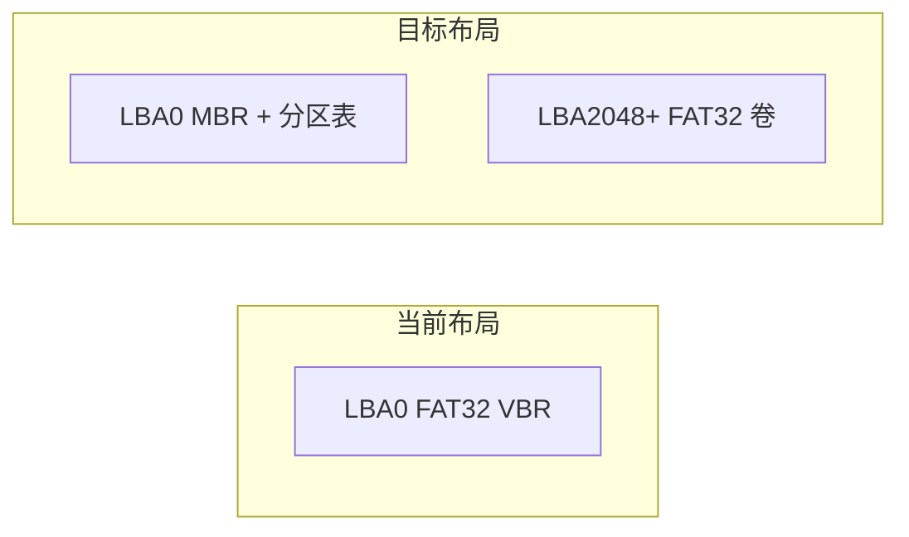

# TF 卡格式化 Windows 兼容优化方案

## 问题根因（结论）

- 实际被调用的是 `[tf_card_format()](runcarplay/src/media/media_tools/TFCard/tf_card_format.c)`（由 `[media_work.c](runcarplay/src/media/media_work/media_work.c)` 的 `TASK_FORMAT_SD` 触发），**不是** `[storageLibrary.c](lvgl-gui/ui/generated/MediaLibrary/storageLibrary.c)` 里的 `format_sd_card_ex`（该函数为 `static`，工程内无引用，属于重复/遗留代码）。
- 现有逻辑对 `**/dev/mmcblk0` 整盘**从 LBA0 开始写 FAT32 引导扇区、FAT、根目录，相当于 无分区表的 FAT32（super-floppy）；BPB 里 `**hidden_sectors` 一直为 0**（见 `write_boot_sector` 中 `memset` 后未设置）。
- **Windows** 对 SD/读卡器上的盘符分配，多数路径依赖 **MBR 分区表**里 **一个主分区**（类型 **0x0C** FAT32 LBA），并在挂载/识别时用 BPB 的 `**hidden_sectors` = 分区起始 LBA**。同事原先“有分区、有盘符”的卡被整盘 FAT 覆盖后，分区表消失，且 super-floppy 在 Windows 上常表现为 **不分配盘符、RAW、要求格式化** 等。
- 关于你提到的“**不分区**”：若指 **只有一个盘符、一块连续空间**，在 PC 上对应的是 **“单一主分区”**，而不是物理上无分区表；**真正无分区的整盘 FAT** 反而容易在 Windows 上不兼容。本方案按 **MBR + 单主分区 + FAT32** 理解你的目标。

## 目标形态

| 项目        | 建议                                                                                                                             |
| --------- | ------------------------------------------------------------------------------------------------------------------------------ |
| 分区表       | **DOS MBR**，**1 个主分区**，类型 **0x0C**（FAT32 LBA）                                                                                  |
| 分区起始      | **LBA 2048**（1 MiB 对齐，与 Windows/Linux 常见约定一致）                                                                                  |
| 分区大小      | `总扇区数 - 2048`                                                                                                                  |
| FAT32 BPB | `**total_sectors_32` = 分区内扇区数**；`**hidden_sectors` = 2048**（与分区起始一致）                                                           |
| 写盘方式      | 仍用现有 `fd` 打开 `**/dev/mmcblk0`**，所有 FAT 元数据与数据区 `**lseek` 到 `partition_offset = 2048 * 512`** 后写入（避免依赖格式化瞬间一定已有 `mmcblk0p1` 节点） |
| 格式化后      | `**ioctl(BLKRRPART)**` 或 BusyBox `**blockdev --rereadpt /dev/mmcblk0**`（若系统有）让内核刷新分区；**挂载改为 `/dev/mmcblk0p1`**                 |

## 实现要点（修改 [tf_card_format.c](runcarplay/src/media/media_tools/TFCard/tf_card_format.c)）

1. **常量**：例如 `#define PARTITION_START_LBA 2048`（若需兼容极小容量卡，可再设下限：分区至少能容纳 FAT32 最小簇数，否则失败并打日志）。
2. **写 MBR**：在 LBA0 写 512 字节：分区表第一项填 **起始 LBA、长度、类型 0x0C**；**0x1FE–0x1FF** 为 `**0x55 0xAA`**；其余引导区可用 0 或简短占位（无需完整 boot code，Windows 主要认分区表）。
3. **调整 FAT32 写入路径**：
  - `write_boot_sector` / `write_fsinfo_sector` / FAT / 根目录：全部相对 `**partition_offset`** 寻址。
  - `**full_format`**：仍建议 **整盘清零**（可清除旧 GPT 备份、多分区残留）；若性能敏感可后续再优化为“清 MBR + GPT 头尾 + 分区内写零”，首版保持整盘清零最稳。
4. **BPB 字段**：除 `hidden_sectors`、`total_sectors_32` 外，其余与现有一致；`sectors_per_track`/`head_count` 可保留现值（63/255）以满足部分检查工具。
5. **格式化结束后**：
  - `close(fd)` 后对 `**/dev/mmcblk0`** 做 `**BLKRRPART`**（失败则打日志；可再试 `blockdev`）。
  - `**mount /dev/mmcblk0p1 /mnt/extsd`**（替换当前硬编码的 `mount /dev/mmcblk0`）。

## 工程内需一并扫齐的挂载/设备路径

以下位置当前使用 `**/dev/mmcblk0`** 挂载到 `**/mnt/extsd**` 或与媒体 TF 一致的路径，改为 `**/dev/mmcblk0p1**`（或抽成单一宏，避免分叉）：

- `[tf_card_format.c](runcarplay/src/media/media_tools/TFCard/tf_card_format.c)` 末尾 `mount`
- `[storageLibrary.c](lvgl-gui/ui/generated/MediaLibrary/storageLibrary.c)` 中 `format_sd_card_ex` 的 `mount`（若保留同步逻辑）
- 其它脚本/模块中与 **同一用户 TF 数据分区** 一致的挂载（需你方确认是否 **仅** 用户 TF 走新布局；若 `**mmcblk0p1` 被占用为机内 config**（见 `[MainThread.cpp](runcarplay/src/app/main/MainThread.cpp)` 挂载 `mmcblk0p1` 到 `/opt/work/config`），必须 **核对硬件分区方案**，避免与用户 TF 冲突——若机内 eMMC 与 TF 卡设备号不同则无冲突；若共设备则需单独分区规划。**这是实施前必须和产品/硬件确认的一点。**

## `storageLibrary.c` 建议

- UI 侧以 `**tf_card_format` 为唯一实现** 已满足需求；**删除或改为调用 `tf_card_format`** 可去重，避免日后只改一处漏改一处（可选，非必须放在第一轮）。

## 验证清单

- 设备上：格式化后 `fdisk -l /dev/mmcblk0` 可见 **一个 FAT32 分区**；`mount /dev/mmcblk0p1 /mnt/extsd` 成功。
- Windows：读卡器插入后应出现 **单个可移动磁盘**，文件系统 **FAT32**，可读写。
- 回归：原“整盘 FAT”卡在 Linux 上若曾用 `mount /dev/mmcblk0`，需改为 `**p1`** 后测播放/媒体库扫描。

## 风险与边界

- **>32GB** 仍用 FAT32：Windows 可能提示用大簇或建议 exFAT；你方已明确 FAT32，保持现状即可。
- 若卡上曾为 **GPT**：整盘 `full_format` 清零可清除隐患；**quick** 仅写元数据时，极端情况下 GPT 备份区若未覆盖，理论上可能干扰个别工具——首版可对 quick 在“检测到 GPT 签名”时强制清首尾若干扇区或提示完整格式化（可选增强）。

